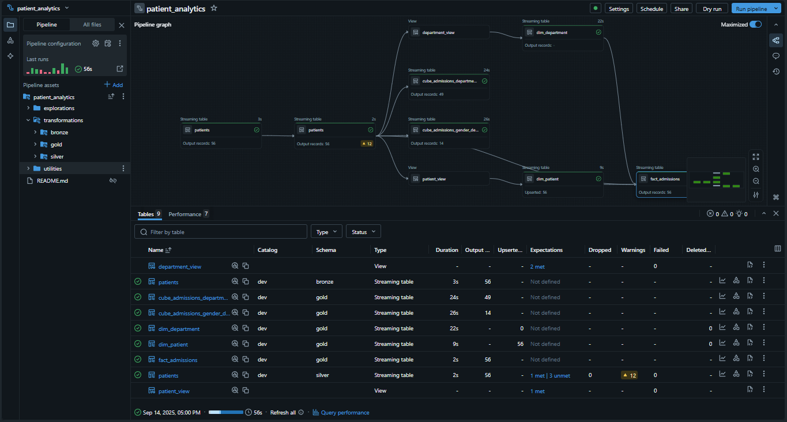
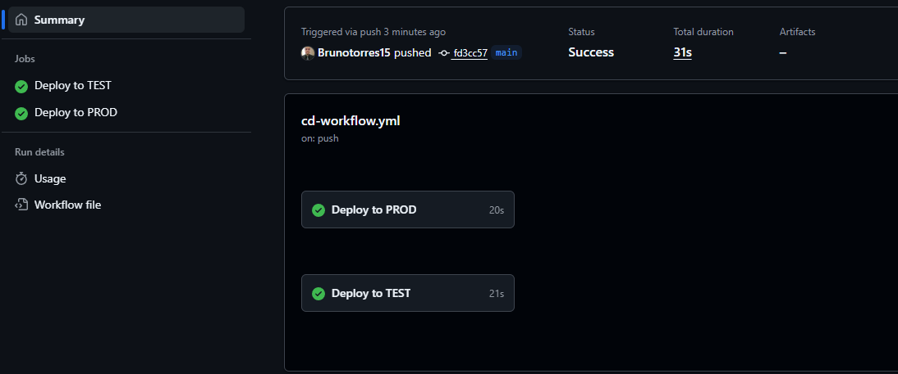

## Summary

1. **[Project Overview](#project-overview)**  
   1.1 **[Introduction](#introduction)**  
   1.2 **[Objectives](#objectives)**  
   1.3 **[Flow of the Architecture](#flow-of-the-architecture)**  
   1.4 **[Technologies Used](#technologies-used)**  

2. **[Architecture Explanation](#architecture-explanation)**  
   2.1 **[Medallion Architecture (Bronze / Silver / Gold)](#medallion-architecture-bronze--silver--gold)**  
   2.2 **[Transformations and Utilities](#transformations-and-utilities)**

3. **[Pipeline and CI/CD](#pipeline-and-cicd)**  
   3.1 **[Release Workflow (dev / test / prod)](#release-workflow-dev--test--prod)**

4. **[How to Use](#how-to-use)**  
   4.1 **[Dependencies and Installation](#dependencies-and-installation)**  
   4.2 **[Local Development and Tests](#local-development-and-tests)**  
   4.3 **[Using the scratch Kafka producer for E2E testing](#using-the-scratch-kafka-producer-for-e2e-testing)**

5. **[Testing](#testing)**  

6. **[Contributing](#contributing)**

---
---

## Project Overview

### Introduction

`healthcare_dab` is a collection of Databricks Declarative Pipelines (DLT) focused on ingesting and transforming patient event data. The goal is to provide reliable, analysis-ready datasets for analytics, BI and ML with built-in data quality checks and an automated deployment pipeline.

### Objectives

- Ingest real-time events produced by Kafka (consumed via Azure Event Hub) and persist them to a landing zone in Blob Storage / ADLS.
- Apply a Medallion (Bronze → Silver → Gold) architecture using Databricks DLT (Lakeflow).
- Enforce data quality via DLT expectations (`@dlt.expect_all`).
- Enable local development and testing (PySpark, pytest, optional `databricks-connect`) and support automated deployments with Databricks Asset Bundles in a CI/CD pipeline.

### Flow of the Architecture

End-to-end flow (high level):

1. Events are produced in Kafka by the source systems.
2. Azure Event Hub consumes Kafka topics and acts as the bridge.
3. A consumer process writes events to Azure Blob Storage / ADLS in Parquet format (landing path).
4. Databricks Auto Loader (`cloudFiles`) reads the landing folder in streaming mode and populates the Bronze table under a controlled catalog (widget `catalog`).
5. DLT pipelines transform Bronze → Silver (validations, time conversions, enrichments) and Silver → Gold (dimensions with CDC/SCD and fact table).
6. Releases and deployments are handled by a DevOps CI/CD pipeline that uses Databricks Asset Bundles to deploy across environments (dev → test → prod).

See the simplified Kafka → Landing diagram:


### Technologies Used

- Databricks DLT (Lakeflow / Declarative Pipelines)
- PySpark (transformations)
- Databricks Auto Loader (`cloudFiles`)
- Azure Event Hub (Kafka consumption)
- Azure Blob Storage / ADLS (landing)
- Databricks Asset Bundles (deploy / CI-CD)
- pytest (unit testing)
## Architecture Explanation

### Medallion Architecture (Bronze / Silver / Gold)

As implementações de cada camada estão em `src/patient_analytics/transformations`:

- Bronze (`bronze/bronze_ingestion.py`): leitura streaming via Auto Loader com `spark.readStream.format("cloudFiles")`. A tabela bronze adiciona `bronze_ingestion_ts` para rastreabilidade.
- Silver (`silver/bronze_to_silver.py`): aplicação de validações (`@dlt.expect_all`), conversão de timestamps e enriquecimento temporal por meio de utilitários em `src/patient_analytics/utilities`.
- Gold (`gold/*.py`): construção das dimensões e fato:
   - `dim_patient` — view deduplicada que gera `patient_sk` (hash) e aplica um fluxo CDC SCD Type 2 via `dlt.create_auto_cdc_flow`.
   - `dim_department` — dimensão com SCD Type 1.
   - `fact_admissions` — tabela fato que realiza joins com dimensões e validações adicionais.

Full pipeline diagram:




### Pipeline and CI/CD (DevOps flow)

Releases for this project follow a CI/CD pipeline that typically includes:

1. Running unit tests (pytest) on Pull Requests.
2. Building the Databricks bundle/artifact.
3. Automated deploys using Databricks Asset Bundles into the `dev`, `test` and `prod` environments (promotion occurs from dev → test → prod as part of the release process).

The diagram below illustrates this CI/CD flow and how releases are promoted across environments:




## How to use this project

### Dependencies and installation

The repository contains multiple dependency manifests to support different use cases:

1. `pyproject.toml` — general project dependencies and developer tools.
2. `requirements-pyspark.txt` — dependencies to run PySpark locally or in an environment with Spark.
3. `requirements-dbc.txt` — dependencies useful for `databricks-connect` or local Databricks tooling.

Recommended local setup (development & testing):

- Create and activate a virtual environment (Python 3.10–3.13 recommended).
- Install `requirements-pyspark.txt` to be able to run PySpark-based transformations and unit tests locally.
- If you plan to use `databricks-connect` to run code against a remote Databricks cluster from your machine, install `requirements-dbc.txt`.

Example (local):

```bash
# create virtualenv
python -m venv .venv
source .venv/bin/activate

# install PySpark dependencies
pip install -r requirements-pyspark.txt

# (optional) install databricks-connect dependencies
pip install -r requirements-dbc.txt
```

### Local development and contribution flow

1. Make changes locally (edit files under `src/patient_analytics/`).
2. Run unit tests (`tests/`) locally to validate changes:

```bash
# if you use the uv manager from the template
uv run pytest

# or directly
pytest -q
```

3. Open a Pull Request. CI will run tests automatically.
4. After PR approval, the CI/CD pipeline will build the Databricks bundle and deploy it to `dev`. The release process promotes artifacts to `test` and then to `prod` as part of the release pipeline.

### Using the scratch Kafka producer for local E2E testing

If you want to perform an end-to-end test that starts at the event source level, use the simulator in `scratch/realtime-kafka-simulator.py`:

The script acts as a simple Kafka producer that sends synthetic patient events to your Event Hub (configured as a Kafka endpoint). It is intended for local testing and end-to-end validation of the ingestion pipeline.

Key notes about the simulator:
- File: `scratch/realtime-kafka-simulator.py`
- It uses the `kafka-python` producer to send JSON events.
- It contains configurable placeholders for `EVENTHUBS_NAMESPACE`, `EVENT_HUB_NAME` and `CONNECTION_STRING` that must be set before running.
- The generator occasionally injects "dirty" data (invalid ages, future admission timestamps) to help exercise the DLT expectations and validation logic.

Basic run instructions:

1. Install the kafka client package:

```bash
pip install kafka-python
```

2. Edit `scratch/realtime-kafka-simulator.py` and replace the placeholders (`<your-eventhub-namespace>`, `<your-eventhub-name>`, `<your-eventhub-connection-string>`) with your Event Hub/Kafka connection values.

3. Run the script:

```bash
python scratch/realtime-kafka-simulator.py
```

The producer will emit one event per second by default. Use this to feed the landing zone (via Event Hub) and validate the full Bronze → Silver → Gold flow.

Note: `requirements-pyspark.txt` lets you validate PySpark functions locally (for DataFrame-based unit tests). `requirements-dbc.txt` is targeted at developers who need `databricks-connect`.

## Testing

- Unit tests are located in `tests/` and cover utilities such as `add_time_columns` and `enrich_with_temporal_attrs`.
- Commands to run tests locally:

```bash
uv run pytest
# or
pytest -q
```

Execution screenshots and test images:


## Contributing

Contributions are welcome. To contribute:

- Run tests locally with `uv run pytest` before opening PRs.
- Keep tests updated and add coverage for new functionality.

---

The README has been translated to English, the Summary completed, and the environments set to `dev`, `test` and `prod` (no staging). If you'd like, I can also produce an English `README_dev.md` with step-by-step local dev/debug instructions or shorten image alt text/sizes.
